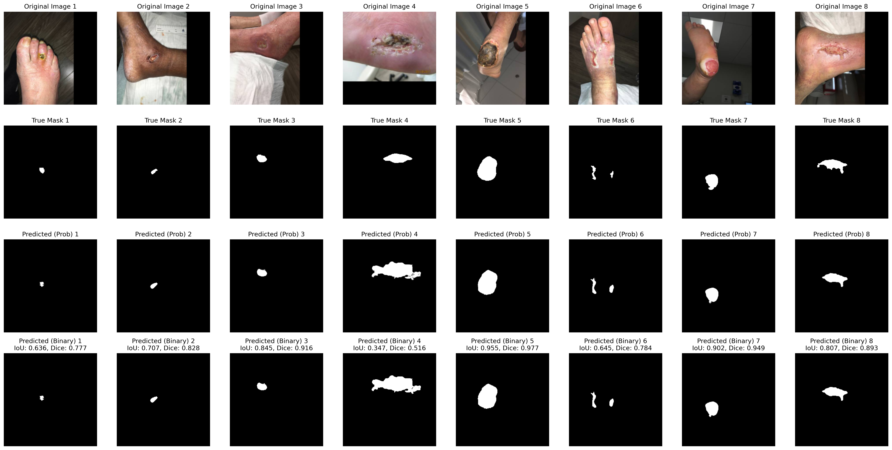

# DFU Segmentation Network

Deep learning model for Diabetic Foot Ulcer (DFU) segmentation using EfficientNet-B4 U-Net architecture.

## File Structure

```
dfu-segmentation-net/
├── evaluate_pretrained_model.py             # Script to evaluate the pretrained model
├── pretrained.py                            # Pretrained model training and util
├── template.py                              # Template/base code
└── pretrained_best_efficientnet_b4_unet_model.pth  # Pretrained model weights
```

## Model Predictions


