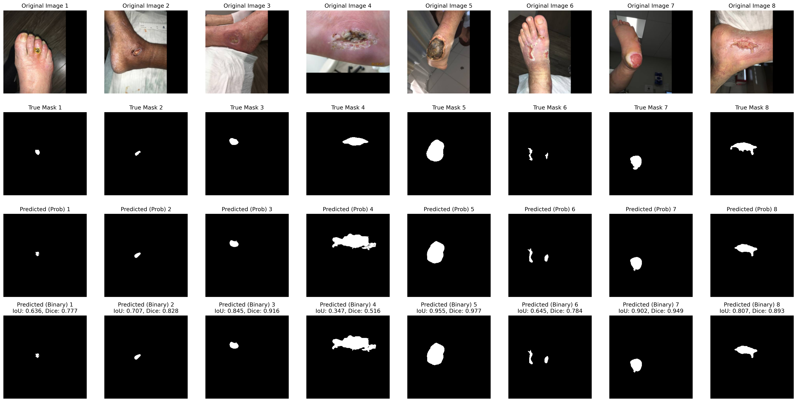

# DFU Segmentation Network

Deep learning model for Diabetic Foot Ulcer (DFU) segmentation using EfficientNet-B4 U-Net architecture, enhanced with a secondary verification classifier to reduce false positives.

## File Structure

```
dfu-segmentation-net/
├── datasets/                        # Downloaded datasets (auto-generated)
├── inference_test/                  # Test images for inference
├── review/                          # Analysis and validation scripts
│   ├── fp.py                        # False positive analysis on non-wound datasets
│   ├── validate_skin_lesions.py     # Validation on skin lesion datasets
│   └── find_optimal_threshold.py    # Threshold optimization script
├── evaluate_pretrained_model.py     # Script to evaluate the segmentation model
├── pretrained.py                    # Segmentation model training and utils
├── template.py                      # Template/base code
├── wound_classifier.py              # Training script for the verification classifier
├── wound_classifier_inference.py    # Full pipeline inference (Segmentation + Verification)
├── pretrained_best_efficientnet_b4_unet_model.pth  # Segmentation model weights
└── wound_classifier_best_model.pth                 # Verification classifier weights
```

## Features

### 1. Segmentation Model

The segmentation model performs **binary semantic segmentation** of Diabetic Foot Ulcers (DFU), producing precise pixel-level delineation of wound boundaries.

#### Architecture
- **Encoder (Backbone):** Uses **EfficientNet-B4** pretrained on ImageNet as the feature extractor, capturing complex textures and patterns from input images.
- **Decoder:** Custom U-Net-style decoder that upsamples feature maps back to original resolution.
- **Skip Connections:** Connects corresponding layers between encoder and decoder (e.g., EfficientNet stage 6 to decoder layers), preserving fine-grained spatial details lost during downsampling—critical for accurate boundary detection.
- **Input/Output:** Takes RGB images (256×256) and outputs binary masks (1 for wound, 0 for background).

#### Training Configuration
- **Loss Function:** Dice Loss (optimizes overlap directly, better handling of class imbalance than Cross Entropy).
- **Optimizer:** Adam (learning rate: 0.001).
- **Dataset:** Trained on the "Wound Segmentation Dataset" from Kaggle.
- **Training Strategy:** Early stopping based on Dice score to prevent overfitting.

#### Performance
Based on evaluation on the test dataset:
- **Dice Coefficient:** ~89.3% (high overlap with ground truth).
- **Intersection over Union (IoU):** ~81.0%.
- **Characteristics:** Optimized for high **Sensitivity (Recall)** to minimize missed wounds, with the trade-off that false positives are filtered by the secondary Verification Classifier.

### 2. Verification Classifier (New)
- **Goal:** Filter out false positives (e.g., skin lesions, background noise) from the segmentation output.
- **Architecture:** Custom CNN taking 4-channel input (RGB Image + Predicted Mask) combined with segmentation percentage features.
- **Training Data:**
  - **Positives:** Wound Segmentation Dataset, Leprosy Chronic Wound Dataset.
  - **Negatives:** MiniImageNet (general objects), Skin Cancer & Skin Disease datasets (hard negatives).

## Usage

### 1. Run Inference (Full Pipeline)
Run the complete pipeline (Segmentation -> Verification) on a folder of images:

```bash
py wound_classifier_inference.py --folder inference_test --output_json inference_results.json
```

**Arguments:**
- `--folder`: Input folder containing images.
- `--seg_model`: Path to segmentation model weights.
- `--verif_model`: Path to verification model weights.
- `--output_json`: Path to save results.

### 2. Train Verification Classifier
Train the binary classifier to distinguish between true wounds and false positives:

```bash
py wound_classifier.py
```
This script handles dataset downloading, balancing, and training automatically.

### 3. Analyze False Positives
Evaluate the segmentation model's performance on non-wound datasets to measure false alarm rates:

```bash
py review/fp.py
```

## Model Predictions




| **Metric**                | **CNN (0.5)** | **ViT (0.5)** | **CNN (0.41)** | **ViT (0.70)** |
|---------------------------|-------------:|-------------:|--------------:|--------------:|
| _AZH Wound Dataset (Sensitivity Test)_ |||||
| Total Images              |     213 |     213 |     213 |     213 |
| True Positives (TP)       |     121 |     132 |     **137** |     125 |
| False Negatives (FN)      |      92 |      81 |     **76** |      88 |
| **Sensitivity (Recall)**  | 56.81% | 61.97% | **64.32%** | 58.69% |
| Avg Confidence            |  0.5471 | **0.6056** |  0.5471 | **0.6056** |
| Avg Segmentation %        |   4.51% |   4.38% |   4.51% |   4.38% |
| _Skin Lesion Dataset (Specificity Test)_ |||||
| Total Images              |     500 |     500 |     500 |     500 |
| False Positives (FP)      |      69 |      57 |      91 |     **32** |
| True Negatives (TN)       |     431 |     443 |     409 |     **468** |
| **Specificity**           | 86.20% | 88.60% | 81.80% | **93.60%** |
| **False Positive Rate**   | 13.80% | 11.40% | 18.20% | **6.40%** |
| Avg Confidence            |  0.2142 | **0.1208** |  0.2142 | **0.1208** |
| Avg Segmentation %        |   3.85% |   3.72% |   3.85% |   3.72% |
| _Combined Metrics_        |||||
| **Precision**             | 63.68% | 69.84% | 60.09% | **79.62%** |
| **F1 Score**              | 60.00% | 65.67% | 62.13% | **67.57%** |

<sub>**Note**: Results shown for both default threshold (0.5) and optimized thresholds (CNN: 0.41, ViT: 0.70) determined by F1 score maximization. Bold values indicate best performance. Lower is better for *False Negatives* and *False Positive Rate*; higher is better for others.</sub>
